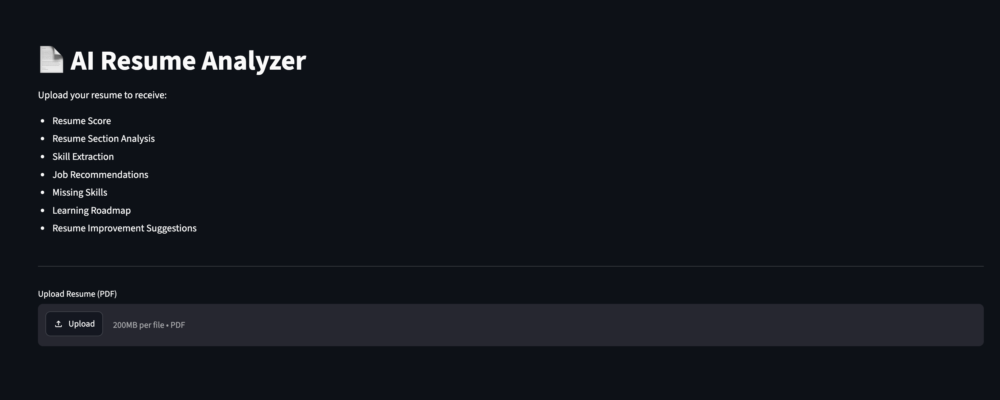
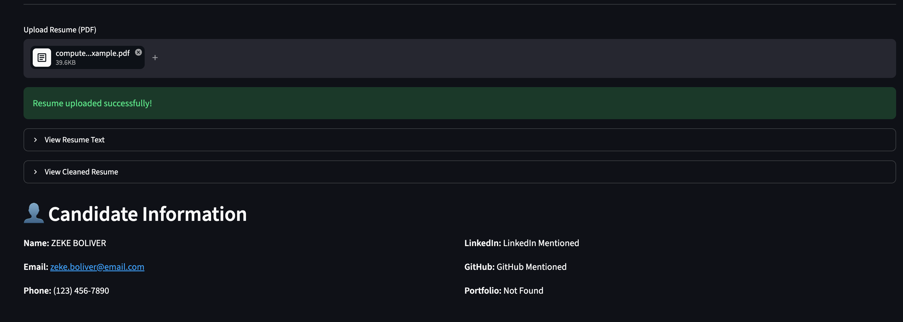
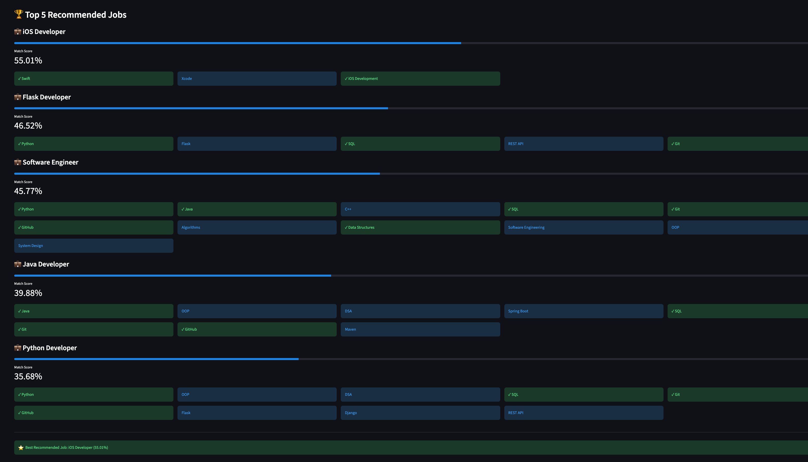
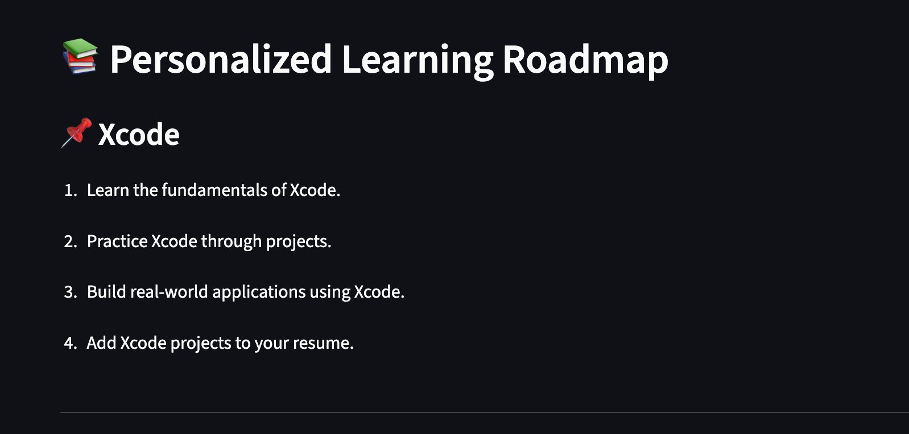

# 📄 AI Resume Analyzer

An AI-powered Resume Analyzer built using **Python** and **Streamlit** that extracts resume information, identifies technical skills, matches resumes with suitable job roles, calculates a resume score, provides improvement suggestions, and generates a personalized learning roadmap.

---

## 🌐 Live Demo

https://ai-resume-analyzer-pz8yjksmhdhoyxj6hfnyrl.streamlit.app

---

## 📌 Overview

AI Resume Analyzer is a web application developed using **Python**, **Streamlit**, **Pandas**, and **Scikit-learn**. The application allows users to upload their resume in PDF format and automatically analyzes it to provide valuable insights.

The system performs the following tasks:

- Extracts resume text from PDF
- Cleans and processes the extracted text
- Extracts personal details
- Identifies technical skills
- Detects resume sections
- Matches the resume with predefined job roles
- Calculates a resume score
- Suggests resume improvements
- Generates a personalized learning roadmap

The application uses **TF-IDF Vectorization** and **Cosine Similarity** to compare resumes with predefined job roles and recommend the best matches.

---

# 🚀 Features

- 📄 Upload PDF Resume
- 📝 Resume Text Extraction
- 🧹 Resume Text Cleaning
- 👤 Personal Details Extraction
- 💡 Automatic Skill Extraction
- 📂 Resume Section Detection
- 🎯 Top Job Role Recommendations
- 📊 Resume Match Percentage
- ⭐ Resume Score Calculation
- ✅ Resume Improvement Suggestions
- ❌ Missing Skill Identification
- 📚 Personalized Learning Roadmap
- 🌐 Interactive Streamlit Web Interface

---

# 🖼️ Application Preview

## Home Page



---

## Resume Analysis



---

## Job Recommendations



---

## Learning Roadmap



---

# 🛠️ Technologies Used

- Python
- Streamlit
- Pandas
- NumPy
- Scikit-learn
- PyMuPDF (fitz)
- Regular Expressions (re)

---

# 📂 Project Structure

```text
AI-Resume-Analyzer/

│── app.py
│── resume_parser.py
│── text_cleaner.py
│── resume_details.py
│── skill_extractor.py
│── section_detector.py
│── job_matcher.py
│── resume_score.py
│── resume_suggestions.py
│── roadmap_generator.py
│── requirements.txt
│── README.md
│── .gitignore
│
├── data/
│   ├── job_roles.csv
│   └── skill_dictionary.csv
│
├── images/
│   ├── home.png
│   ├── resume_analysis.png
│   ├── job_recommendation.png
│   └── roadmap.png
│
└── sample_resumes/
```

---

# ⚙️ How It Works

1. Upload a resume in PDF format.
2. Extract text from the uploaded resume.
3. Clean and preprocess the extracted text.
4. Extract personal details such as Name, Email, Phone Number, LinkedIn, GitHub, and Portfolio.
5. Identify technical skills using the skill dictionary.
6. Detect important resume sections.
7. Compare the resume with predefined job roles using TF-IDF and Cosine Similarity.
8. Display the top matching job roles with similarity scores.
9. Calculate a resume score.
10. Suggest improvements and identify missing skills.
11. Generate a personalized learning roadmap.

---

# 📊 Datasets

The application uses two CSV files:

### `skill_dictionary.csv`

Contains a list of technical skills used for skill extraction.

### `job_roles.csv`

Contains predefined job roles and their required skills for job matching.

---

# 🔮 Future Enhancements

- Support DOCX resumes
- AI-based resume summarization
- ATS compatibility analysis
- Resume ranking for recruiters
- Support for resumes from multiple domains
- Integration with online job portals

---

# 👨‍💻 Author

**Your Name**

B.Tech – Computer Science and Engineering

---

# 📄 License

This project is developed for educational and academic purposes.
