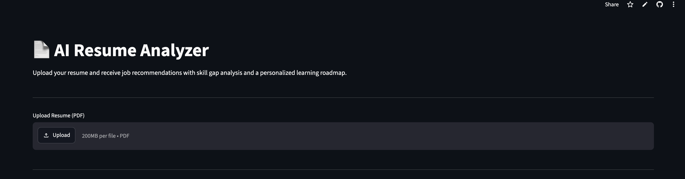
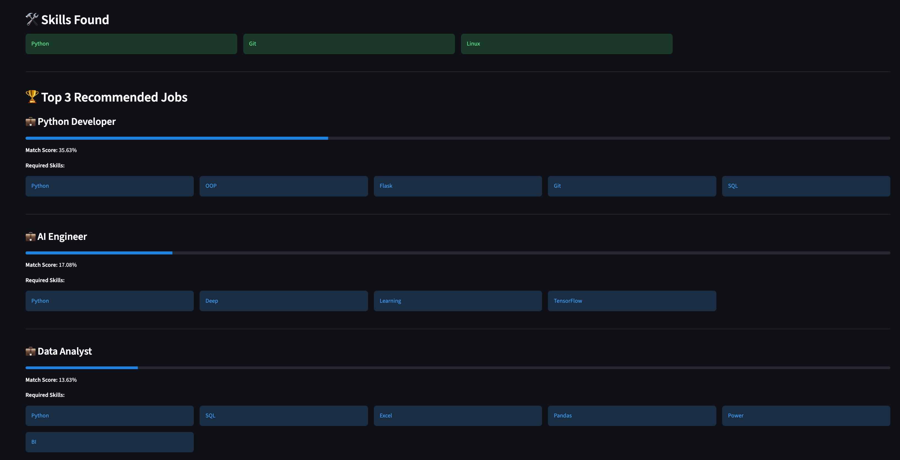

# 📄 AI Resume Analyzer

A Python-based AI Resume Analyzer that extracts skills from a resume, recommends suitable job roles, identifies missing skills, and generates a personalized learning roadmap using TF-IDF and Cosine Similarity.

---

## 🌐 Live Demo

🔗 https://ai-resume-analyzer-kxnbb8tjak94cncmpunj9n.streamlit.app/

---

## 📌 Overview

AI Resume Analyzer is a web application built with **Python**, **Streamlit**, **Pandas**, and **Scikit-learn**. Users can upload their resume in PDF format, and the application automatically:

- Extracts resume text
- Cleans and processes the text
- Identifies technical skills
- Matches the resume with suitable job roles
- Displays the top 3 job recommendations
- Shows missing skills
- Generates a personalized learning roadmap

The project uses **TF-IDF Vectorization** and **Cosine Similarity** to recommend the most relevant job roles.

---

# 🚀 Features

- 📄 Upload PDF Resume
- 📝 Resume Text Extraction
- 🧹 Resume Text Cleaning
- 💡 Automatic Skill Extraction
- 🎯 Top 3 Job Recommendations
- 📊 Match Percentage
- ❌ Missing Skill Identification
- 📚 Personalized Learning Roadmap
- 🌐 Interactive Streamlit Web Interface

---

# 🖼️ Application Preview

## Home Page



---

## Job Recommendations



---

## Learning Roadmap


---

# 🛠️ Technologies Used

- Python
- Streamlit
- Pandas
- Scikit-learn
- PyPDF
- Python-docx

---

# 📂 Project Structure

```text
AI-Resume-Analyzer/

│── app.py
│── resume_parser.py
│── text_cleaner.py
│── skill_extractor.py
│── job_matcher.py
│── roadmap_generator.py
│── requirements.txt
│── README.md
│── .gitignore
│
├── data/
│   ├── job_roles.csv
│   └── skill_dictionary.csv
│
├── images/
│   ├── home.png
│   ├── recommendation.png
│   └── roadmap.png
│
└── sample_resumes/
    ├── Python_Developer_Resume.pdf
    └── Data_Analyst_Resume.pdf
```

---

# ⚙️ Installation

Clone the repository.

```bash
git clone https://github.com/dumpasasank5171/AI-Resume-Analyzer.git
```

Move into the project folder.

```bash
cd AI-Resume-Analyzer
```

Install the required libraries.

```bash
pip install -r requirements.txt
```

Run the application.

```bash
streamlit run app.py
```

---

# 📖 How to Use

1. Launch the application.
2. Upload a PDF resume.
3. Wait for the resume to be processed.
4. View the extracted resume text.
5. Review the detected skills.
6. Explore the top 3 recommended job roles.
7. Check missing skills.
8. Follow the generated learning roadmap.

---

# 🔄 Workflow

```text
Upload Resume
       │
       ▼
Extract Resume Text
       │
       ▼
Clean Resume Text
       │
       ▼
Extract Skills
       │
       ▼
TF-IDF Vectorization
       │
       ▼
Cosine Similarity
       │
       ▼
Top Job Recommendations
       │
       ▼
Missing Skills
       │
       ▼
Learning Roadmap
```

---

# 📊 Modules

### Resume Parser

Extracts text from uploaded PDF resumes.

---

### Text Cleaner

Removes unnecessary characters and converts text into a clean format suitable for analysis.

---

### Skill Extractor

Identifies technical skills using a predefined skill dictionary.

---

### Job Matcher

Uses TF-IDF Vectorization and Cosine Similarity to compare resume skills with job role requirements.

---

### Roadmap Generator

Suggests learning resources for missing skills required for the recommended job role.

---

# 🎯 Future Improvements

- Resume score prediction
- ATS compatibility analysis
- Resume improvement suggestions
- Support for DOCX resumes
- AI-generated career advice
- Integration with job portals
- Resume keyword optimization

---

# 👨‍💻 Author

**Dumpa Sasank**

B.Tech – Computer Science

---

# 📜 License

This project is developed for educational and academic purposes.